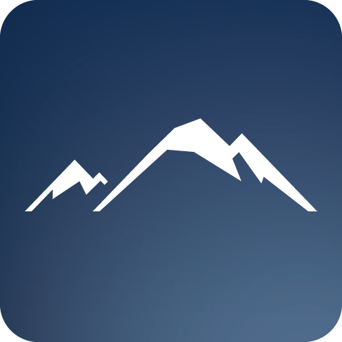

<p align="center">
  
</p>

<h1 align="center">yukiyama</h1>

<p align="center">
  Go SDK for the yukiyama API.
</p>

<p align="center">
  <a href="https://pkg.go.dev/github.com/ekkx/yukiyama"></a>
  <a href="./LICENSE"></a>
  
</p>

<p align="center">
  
</p>

## Install

```bash
go get github.com/ekkx/yukiyama
```

## Quick start

```go
package main

import (
    "context"
    "log"

    "github.com/ekkx/yukiyama"
)

func main() {
    ctx := context.Background()

    client, err := yukiyama.NewClient(
        yukiyama.WithCredentials("you@example.com", "password"),
        yukiyama.WithSessionStore(yukiyama.NewFileSessionStore("")),
    )
    if err != nil {
        log.Fatal(err)
    }

    // FileSessionStore hydrates from disk; second run skips Login.
    if !client.IsAuthenticated() {
        if err := client.Login(ctx); err != nil {
            log.Fatal(err)
        }
    }

    profile, err := client.GetMyProfile(ctx)
    if err != nil {
        log.Fatal(err)
    }
    log.Printf("hello, %s", profile.GetProfile().GetUserName())
}
```

## Highlights

| | |
| --- | --- |
| **Flat API** | Every operation is promoted directly onto `*Client` — no service-tag prefix needed. `client.GetMaster(ctx).Execute()` just works. |
| **Session lifecycle** | `Login` / `Logout` / `Withdraw` with the underlying `(user_id, token)` cached automatically. |
| **Pluggable persistence** | Built-in `FileSessionStore` (atomic write, mode `0600`), or implement the `SessionStore` interface for Redis / Keychain / etc. |
| **Transparent re-login** | `error_code: 103` is detected, the cached session is cleared, `Login` runs again, and the original request is retried once. |
| **Typed Options** | Endpoints with many optional filters take an `Options` struct of pointer fields so omission and the empty string never get confused. |
| **Wire corrections built in** | Wire-naming quirks (caller/target reversals, content-schema `version` selectors, username-as-`user_id`, etc.) are handled by the handwritten facades so callers don't repeat them. |

## Low-level access

Operations without a handwritten facade are still flat:

```go
client.GetMaster(ctx).Execute()
client.ListMyCoupons(ctx).Execute()
client.GetUnreadCount(ctx).Execute()
```

When a facade and a generated method share a name (e.g. `GetHomeData`), Go's
method resolution picks the facade. Reach for the unwrapped gen builder via
the embedded field name or via `Gen()`:

```go
client.CommonAPIService.GetHomeData(ctx).Execute()
client.Gen().CommonAPI.GetHomeData(ctx).Execute()
```

## Documentation

Full API reference: [pkg.go.dev/github.com/ekkx/yukiyama](https://pkg.go.dev/github.com/ekkx/yukiyama).

## Status

Pre-1.0. The Go module pins API version **10.3.3**. Breaking changes are
possible as either the upstream or the SDK firms up — see the godoc on
`yukiyama.APIVersionName` and `yukiyama.SDKVersion`.
